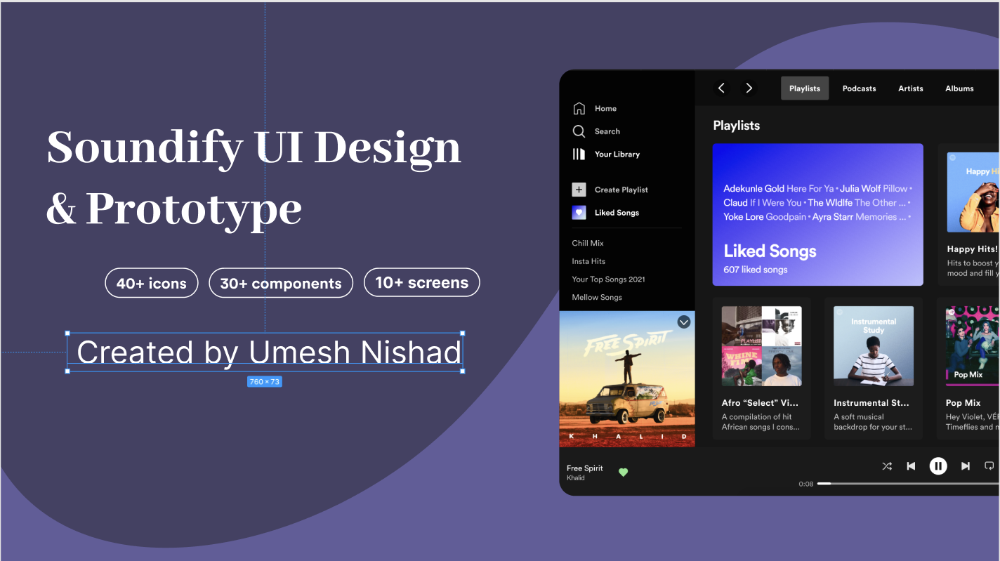

# Soundify-Figma-Project-

# 🎧 Soundify – Music Player UI Design

Soundify is a modern and visually appealing **music player UI design** created using Figma. It is inspired by popular music streaming platforms and focuses on delivering a clean, intuitive, and engaging user experience.

---

## 📌 Project Overview

Soundify is designed to provide users with a seamless way to explore music, browse playlists, and control playback. The interface emphasizes simplicity, smooth navigation, and aesthetic consistency, making it both user-friendly and visually attractive.

This project demonstrates strong UI/UX design skills and can be used as a base for developing a real-world music streaming application.

---

## 🎯 Features

* 🎵 Clean and modern music player interface
* 📱 User-friendly and intuitive navigation
* 🎨 Consistent color scheme and typography
* 🔍 Easy browsing of songs and playlists
* ⏯️ Interactive music controls (play, pause, skip)
* 🚀 Ready to be converted into a frontend application

---

## 🎨 Figma Design

👉 View the complete design here:
[Open in Figma](https://www.figma.com/design/itY0sabAtuXq6kfC4fP49P/Soundify-Project-Main-Design?t=Uvx4PPfln6blin6j-0)

---

## 📸 Screenshots

*Add your exported UI screens here*

```
/assets
   ├── Cover.png
   ├── player.png
   ├── playlist.png
```

Example:




---

## 🛠️ Tools & Technologies

* Figma (UI/UX Design)
* Design Principles (Typography, Color Theory, Layout)

---

## 🚀 Future Scope

* Convert UI into a working web app using React
* Add backend integration for music streaming
* Implement authentication and user playlists
* Make the design fully responsive

---

## 💡 Learning Outcomes

* Improved UI/UX design skills
* Better understanding of layout and hierarchy
* Experience with real-world app design concepts
* Hands-on practice with Figma tools and components

---

## 👨‍💻 Author

**Umesh Nishad**
MCA Student | Python Developer | UI/UX Enthusiast

---

## ⭐ Support

If you like this project, give it a ⭐ on GitHub and share your feedback!

---

**“Soundify – Feel the music, beautifully designed.” 🎶**
